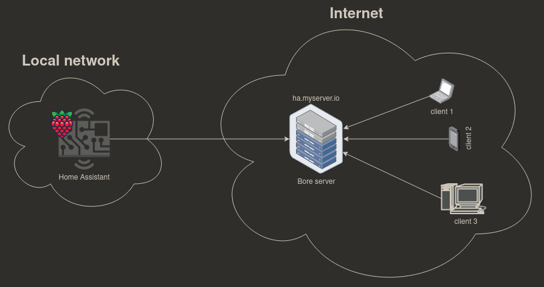
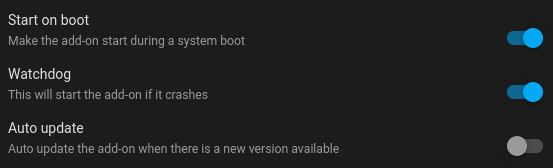

# Bore tunnel

## What is bore

----------------------------------
Bore is a tunneling tool that allows you to expose your local network to the internet.
It works by creating a tunnel to a public endpoint on the bore server, which then can be accessed
from anywhere.


## Usage

----------------------------------
Bore is used in this case to forward your traffic. So that you could for example use the home
assistant app to connect to your home assistant app
outside your local network. Like turning on your heater when you are on your way home.


## Installation

----------------------------------
### Configuration
```yaml
port: 8123
outgoing_port_reverse_proxy: 80
ip: "ha.myserver.io"
secret: "my-super-secure-password"
```

This configuration is going to forward the homeassisant panel to `ha.myserver.io` on port 80 
using the secret `my-super-secure-password` to authenticate.
The password is optional but recommended.
### Setup
Run a bore server instance on a public server. This maybe an aws instance or vps etc.

```bash
# This is an example, you can compile etc.
docker run -itd --init --rm --network host ekzhang/bore server --secret my-super-secure-password
```
For further information see the [bore repository](https://github.com/ekzhang/bore)

## Recommendation

----------------------------------
Run this plugin with watchdog enabled and start on boot without auto update.



## Support

----------------------------------

If you have any questions or issues with this plugin, please open an issue on the GitHub repository
or send an [email](red44.public@gmail.com).

## Author 

----------------------------------
**plugin**: [Red44](https://github.com/Red44)   
**bore**: [ekzhang](https://github.com/ekzhang)
